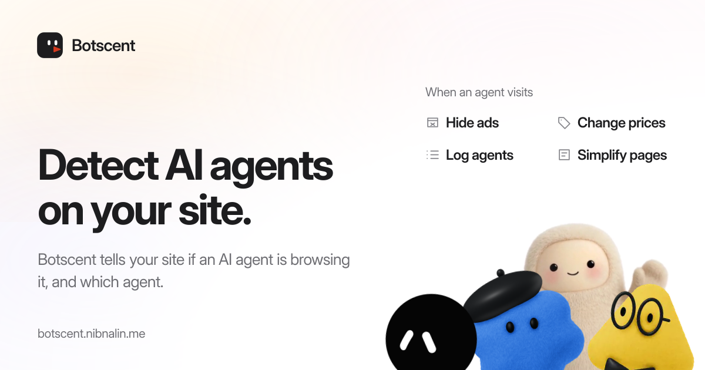

[](https://botscent.nibnalin.me)

# Botscent

Botscent tells your site if an AI agent, not a person, is browsing it, and which agent. Use it to hide ads from agents, change prices, log agent traffic, or give agents a simpler page.

[Website](https://botscent.nibnalin.me) · [Docs](https://botscent.nibnalin.me/docs) · [Install with one prompt](#install-with-one-prompt)

- **It names the agent.** Claude for Chrome, ChatGPT's agent, the Codex browser, Muse, Manus, Devin, Grok Bot and more. It also detects crawlers, fetchers and HTTP clients that say what they are. [Coverage](#coverage) lists every name.
- **It is small.** The page script is about 5 KB gzipped, with 0 dependencies. It starts in about 5 ms on a budget phone's CPU, and CI [measures that](docs/performance.md) on every change.
- **It sends nothing.** The page script makes no network request and writes no cookie or storage. Nothing leaves the page unless your code sends it.
- **It runs where you do.** Next.js, React, Vue, Nuxt, SvelteKit, Astro, Express, Hono, Cloudflare Workers, Netlify and Vercel in TypeScript. FastAPI, Starlette, Django and Flask in Python.
- **It only reports.** It has no blocking, challenges or rules of its own. You decide what to do with the verdict.

```ts
type Verdict = {
  type: 'agent' | 'human' // 'human' means no agent evidence observed, not proof of a person
  agent_name?: string // when the evidence names the agent, e.g. 'claude-chrome'
  reasons: Reason[] // rule ids, strongest first; [] for 'human'
}
```

## How it works

Botscent has two halves. Both return the same verdict.

- **The server half** reads what one request declares: a [Web Bot Auth](https://datatracker.ietf.org/doc/draft-ietf-webbotauth-httpsig-protocol/) signature checked against the keys bundled in each release, a user-agent token that an agent or crawler publishes for itself, or your host's verified-bot field. It reads headers only and calls no service. It sees agents that sign or declare their requests.
- **The page half** watches the page for the marks that agents leave: the automation flag, the shape of agents' cloud browsers, the markers that agent extensions draw, and input that arrives while the page is hidden. It sees agents that run inside a person's own browser. Once it sees an agent, the page stays `agent`.

Botscent 1.0 detects the agents in [Coverage](#coverage), and names one only when the evidence identifies it. `human` means that Botscent saw no agent evidence. It is never proof of a person. Some evidence describes an agent's surface, not who is at the keyboard. So a person who works inside the Codex browser, inside Grok Bot's cloud computer, or in a Muse or ChatGPT agent session they took over, is reported as that agent. Grok Bot is named by its signature when its traffic leaves Grok's cloud, and by the page half when the Grok app sends it through the user's own computer (the default). Botscent does not detect automation built to look like a person, and it does not manage crawlers or decide access for you. Comet and Windows assistive tools are not yet measured.

## Install with one prompt

Paste this into Claude Code, Cursor, Codex or Copilot:

```text
Install Botscent in this project. Follow https://botscent.nibnalin.me/install.md: detect this project's framework, install the botscent package, add the page half and the server half where it says, then run `npx botscent check <url>` against the running site.
```

The agent follows the same steps as the quickstart below.

## Quickstart

```sh
npm install botscent      # pip install botscent for the Python server half
```

Every framework below has a tested app in [`examples/`](examples). Run `npx botscent check <url>` afterwards (see [Verify](#verify)).

### Next.js

```ts
// instrumentation-client.ts (Next.js 15.3 or later): the page half, before hydration
import 'botscent/auto'
```

Before Next.js 15.3, which has no `instrumentation-client.ts`, render `<Botscent />` from `botscent/react` once in the root layout instead.

```ts
// proxy.ts (Next.js 16 or later): the server half
export { proxy } from 'botscent/next'
```

```ts
// middleware.ts (before Next.js 16): the server half
export { proxy as middleware } from 'botscent/next'
```

An existing proxy or middleware is wrapped, not replaced: `export const proxy = withBotscent(existingProxy)` (`export const middleware = withBotscent(existingMiddleware)` before Next.js 16), with `withBotscent` from `botscent/next`.

```tsx
'use client'
import { useBotscent } from 'botscent/react'

export function VerdictView() {
  const verdict = useBotscent() // re-renders when the page's verdict changes
  return <pre>{JSON.stringify(verdict)}</pre>
}
```

Route handlers ask about their own request: `const verdict = await inspect(request)`, with `inspect` from `botscent/server`.

### React, Vue, Nuxt, SvelteKit, Astro

```tsx
// React without Next.js: <Botscent /> starts observation when it mounts
import { Botscent, useBotscent } from 'botscent/react'
```

```ts
// Vue: the plugin starts observation; useBotscent() is a read-only ref
import { Botscent, useBotscent } from 'botscent/vue'
createApp(App).use(Botscent).mount('#app')
```

```ts
// Nuxt: a client plugin, and useBotscent() auto-imported
export default defineNuxtConfig({ modules: ['botscent/nuxt'] })
```

```ts
// SvelteKit: in src/hooks.client.ts; then $botscent in any component
import 'botscent/auto'
import { botscent } from 'botscent/svelte'
```

```js
// Astro: both halves; Astro.locals.botscent on on-demand routes
import botscent from 'botscent/astro'
export default defineConfig({ integrations: [botscent()] })
```

SvelteKit and Nuxt have no server adapter; where a route needs the request's verdict, ask for it:

```ts
// SvelteKit: hooks.server.ts or a +server.ts route
import { inspect } from 'botscent/server'
const verdict = await inspect(event.request)
```

```ts
// Nuxt: a Nitro server middleware or route
import { inspect } from 'botscent/server'
const verdict = await inspect(event.node.req)
```

### A plain script tag

```html
<script defer src="/botscent.js"></script>
<!-- serve node_modules/botscent/dist/botscent.js from your own origin; add data-debug to log -->
```

The script has no inline code and no `eval`. Under a strict Content Security Policy, a bundled import runs under your application's own policy; the script tag needs `script-src` to allow its origin (`'self'` when you serve it yourself), or a nonce on the tag with `'strict-dynamic'`.

It exposes `window.botscent` (`verdict()`, `subscribe()`, `reportHeaders()`, `diagnostics()`, `start()`, `VERSION`) and dispatches a `botscent` event on every change.

### Express, Hono, Cloudflare Workers, Netlify, Vercel

```ts
// Express: req.botscent in every handler
import { botscent } from 'botscent/express'
app.use(botscent())
```

```ts
// Hono: c.get('botscent')
import { botscent } from 'botscent/hono'
const app = new Hono().use(botscent())
```

```ts
// Cloudflare Workers: the verdict is the handler's fourth argument
import { withBotscent } from 'botscent/workers'
export default { fetch: withBotscent(async (request, env, ctx, verdict) => fetch(request)) }
```

```ts
// Netlify Edge Functions: the same adapter, continuing to the site
import type { Context } from '@netlify/edge-functions'
import { withBotscent } from 'botscent/workers'
export default withBotscent<Context>((request, context) => context.next())
```

```ts
// Vercel Routing Middleware, for projects that are not Next.js: middleware.ts at the root
export { default } from 'botscent/vercel'
```

### Python: FastAPI, Starlette, Django, Flask

```python
# FastAPI and Starlette: request.state.botscent
from botscent.asgi import BotscentMiddleware
app.add_middleware(BotscentMiddleware)
```

```python
# Django: request.botscent
MIDDLEWARE = [..., "botscent.django.BotscentMiddleware"]
```

```python
# Flask: flask.g.botscent
from botscent.flask import Botscent
Botscent(app)
```

```python
# Anything else
import botscent
verdict = botscent.inspect(request)  # a Request, a dict of headers, or anything with .headers
```

## Verify

```sh
npx botscent check https://your-site.example/
```

`check` requests the page as itself and then anonymously, opens it in a local Chrome (which, like any automation, sets the webdriver flag the page half reports), and scans the project it runs in. Each check prints `pass`, `fail`, `unknown` or `skipped`, what was observed, and for anything but a pass the likely cause and the fix. `--json` is for scripts and agents, `--report` prints a block to paste into an issue, and the exit code is 0 when installed, 1 when broken and 2 when neither half could be confirmed.

## Use the verdict

Start by logging verdicts for a week, then decide what to change. Each use needs a different verdict:

- **To adapt a page** (hide ads, show a simpler layout): read the page verdict with `useBotscent()`, `$botscent` or `verdict()`.
- **To measure** (log agent traffic, count agents by name): send the page verdict to your server and join it to the request's own verdict with `combine`.
- **To give an agent access** (skip a challenge, raise a rate limit): use only `isVerified` on the request's own verdict.

## From the page to your server

The page half sends nothing on its own. To tell your server what the page saw, spread its headers into a same-origin request, or opt a form in:

```ts
import { reportHeaders } from 'botscent'
await fetch('/api/checkout', { method: 'POST', headers: { 'content-type': 'application/json', ...reportHeaders('/api/checkout') }, body })
```

```html
<form method="post" action="/checkout" data-botscent-field>...</form>
```

The form gets a `botscent` field only on its own POST submission to the same origin (a click, Enter or `requestSubmit()`); `form.submit()` and `new FormData(form)` never get it, because their data can go anywhere. A form your code sends with `fetch` carries the report through `reportHeaders(url)` instead.

On the server, a report never mixes with the request's own evidence unless you join them:

```ts
import { combine, inspect, isVerified, readReport } from 'botscent/server'

const own = await inspect(request) // what this request declared: use this for decisions
const report = readReport(request.headers.get('botscent-report')) // what the page reported; reasons gain 'page.'
const combined = combine(own, report) // for measurement: most agent wins
if (isVerified(own)) {
  // some bot proved who sent the request: a verified signature or the platform's verified-bot field
}
if (isVerified(own, 'chatgpt')) {
  // a signature verified against ChatGPT's bundled keys
}
```

A page report can be forged by the page's own scripts, and anyone can send the headers that produce a name, so access decisions use `isVerified` on the request's own verdict, never a reason string, a bare `agent_name` or a report. To let one agent through, pass its name: `isVerified(own, 'chatgpt')`. Checking `isVerified(own) && own.agent_name === 'chatgpt'` instead can pair the platform's verification of some bot with a name that bot merely declared.

## The trust model

The request's own verdict (`inspect`) is what the request declared. It is the only verdict to use for anything security-relevant. Within it, `isVerified` is the one check fit for letting an agent past something. With a name, it is true only when a Web Bot Auth signature from that agent verified against a key bundled in this release. Without a name, it is also true when your host verified the bot.

`isVerified` authenticates the operator's infrastructure, not the person or the model in the session. A captured signature can be replayed to the same host within its window. A name without verification is a declaration or a product shape that anyone can produce, so it never grants access. The page verdict, a page report carried to your server, and anything `combine` returns are computed in the visitor's browser. Use them to adapt an interface and to measure, not for access. None of them is a claim about the person behind an agent, or about who performed a particular action.

## How the request's verdict reaches the page

For an agent's document navigation, the server adapters can add a `Server-Timing: botscent;desc="…"` entry with `Cache-Control: no-store`, which the page half reads, so a single page sees both halves. People's responses never carry it, and the page ignores an entry that is stale or doubled. Every server adapter takes `transport`. Where an adapter can know it runs per request in front of the cache it accepts `'auto'`, the default, which turns it on there: the Next.js proxy on Vercel, Vercel Routing Middleware, Cloudflare Workers, Netlify Edge Functions, and Hono on Cloudflare Workers. An origin (Express, Astro, Hono on Node.js, Django, FastAPI, Flask, self-hosted Next.js) cannot see whether a CDN in front of it stores HTML, so there it is off unless you set `transport: 'always'` (Python: `transport=True`), which states that no shared cache stores your HTML. If one does and ignores `Cache-Control: no-store`, a person can be served an agent's entry; `npx botscent check` reports that case.

## Reasons

<!-- generated:reasons -->

Reasons, strongest first. A reason that names gives `agent_name` when every naming source agrees.

| Reason                                | Half    | Names                 | What it means                                                                                                                                                                                                                                          |
| ------------------------------------- | ------- | --------------------- | ------------------------------------------------------------------------------------------------------------------------------------------------------------------------------------------------------------------------------------------------------ |
| `signer.web-bot-auth.verified`        | request | yes, signer           | A Web Bot Auth signature on the request verified against a key bundled with this release.                                                                                                                                                              |
| `signer.edge-verified-bot`            | request | no                    | The hosting platform verified the request as a known bot (Cloudflare's verified-bot category).                                                                                                                                                         |
| `signer.web-bot-auth.declared`        | request | yes, signer           | The request carries a Web Bot Auth signature that did not verify here: an unknown or expired key, a signature outside its window, or a check that failed.                                                                                              |
| `ua.declared-agent-token`             | request | yes, token            | The user agent contains a token that declares software: an agent, fetcher, crawler, link previewer or HTTP client.                                                                                                                                     |
| `ua.page-declared-engine`             | page    | yes, page-declaration | The page's own navigator declares a hosted browser engine.                                                                                                                                                                                             |
| `browser.webdriver-flag`              | page    | no                    | navigator.webdriver is true: the browser declares that automation controls it.                                                                                                                                                                         |
| `ua.headless-chrome`                  | request | no                    | The user agent declares headless Chrome.                                                                                                                                                                                                               |
| `muse.cloud-browser.password-manager` | page    | yes, muse             | 1Password's accessor family on the credential methods, in Chrome 139 or later on Linux x86_64 rendering WebGL with SwiftShader: Muse's cloud browser.                                                                                                  |
| `instinct.credentials.wrappers`       | page    | yes, instinct         | The credential methods are wrapped the way Instinct's cloud desktop wraps them; counts only together with the GeeTest pair.                                                                                                                            |
| `instinct.geetest.accessor-pair`      | page    | yes, instinct         | The GeeTest initialisers are the accessor pair Instinct installs; counts only together with the credential wrappers.                                                                                                                                   |
| `grok.cloud-computer.environment`     | page    | yes, grok-bot         | Grok Bot's cloud computer: Chrome 139 or later on Linux x86_64 rendering WebGL with SwiftShader, with at least 5 of 6 signs (a 1280x800 screen, the Ubuntu, Droid Sans and Cambria fonts, conditional mediation unavailable, the Google Chrome brand). |
| `codex.prompt.anonymous-native`       | page    | yes, codex-browser    | window.prompt has the Codex in-app browser's shape; counts only with a second Codex shell signal.                                                                                                                                                      |
| `codex.keyboard.empty-layout-map`     | page    | yes, codex-browser    | The keyboard layout map is empty, as in the Codex in-app browser; counts only with a second Codex shell signal.                                                                                                                                        |
| `codex.overlay.shadow-root`           | page    | yes, codex-browser    | The Codex in-app browser's overlay is attached to the document; counts only with a second Codex shell signal.                                                                                                                                          |
| `chatgpt.badge.active`                | page    | yes, chatgpt-chrome   | ChatGPT for Chrome's activity badge was drawn on the page while its agent acted.                                                                                                                                                                       |
| `claude.marker.active`                | page    | yes, claude-chrome    | Claude for Chrome's activity marker was drawn on the page while its agent acted.                                                                                                                                                                       |
| `hidden.input.focus-emulated`         | page    | no                    | Trusted input arrived while the document was hidden yet reported focus, which needs focus emulation.                                                                                                                                                   |
| `hidden.input.trusted-pointerdown`    | page    | no                    | A trusted pointerdown arrived while the document was hidden, which no person can produce.                                                                                                                                                              |

<!-- /generated -->

## Coverage

<!-- generated:coverage -->

Named agents: 100, from [the registry](registry/names.json). Software the registry does not name, such as a browser under automation, is still reported as an agent, without a name.

**Agents that operate a browser**

| Agent                | Vendor                  | `agent_name`     | Evidence                                                                                                     |
| -------------------- | ----------------------- | ---------------- | ------------------------------------------------------------------------------------------------------------ |
| ChatGPT              | OpenAI                  | `chatgpt`        | signature from `chatgpt.com`                                                                                 |
| ChatGPT for Chrome   | OpenAI                  | `chatgpt-chrome` | page: `chatgpt.badge.active`                                                                                 |
| Claude for Chrome    | Anthropic               | `claude-chrome`  | page: `claude.marker.active`                                                                                 |
| Codex in-app browser | OpenAI                  | `codex-browser`  | page: two of `codex.prompt.anonymous-native`, `codex.keyboard.empty-layout-map`, `codex.overlay.shadow-root` |
| Devin                | Cognition               | `devin`          | user agent `Devin`                                                                                           |
| Google-Agent         | Google                  | `google-agent`   | user agent `Google-Agent`                                                                                    |
| Grok Bot             | Anysphere               | `grok-bot`       | signature from `cursorusercontent.com`; page: `grok.cloud-computer.environment`                              |
| Instinct             | Spear Street Technology | `instinct`       | page: `instinct.credentials.wrappers` with `instinct.geetest.accessor-pair`                                  |
| Manus                | Manus                   | `manus`          | signature from `api.manus.im`; user agent `Manus-User`                                                       |
| Muse                 | Meta                    | `muse`           | page: `muse.cloud-browser.password-manager`                                                                  |
| Nova Act             | Amazon                  | `agent-novaact`  | user agent `Agent-NovaAct`                                                                                   |

**Browser automation**

| Agent                  | Vendor     | `agent_name`             | Evidence                                                                                                                                      |
| ---------------------- | ---------- | ------------------------ | --------------------------------------------------------------------------------------------------------------------------------------------- |
| Cloudflare Browser Run | Cloudflare | `cloudflare-browser-run` | signature from `web-bot-auth.cloudflare-browser-rendering-085.workers.dev`; page: user agent `Kitesurf/`; page: platform `Cloudflare Workers` |

<details><summary>Fetchers acting for a user (15)</summary>

| Agent                    | Vendor     | `agent_name`               | Evidence                              |
| ------------------------ | ---------- | -------------------------- | ------------------------------------- |
| Amzn-User                | Amazon     | `amzn-user`                | user agent `Amzn-User`                |
| ChatGPT-User             | OpenAI     | `chatgpt-user`             | user agent `ChatGPT-User`             |
| Claude-User              | Anthropic  | `claude-user`              | user agent `Claude-User`              |
| FeedFetcher-Google       | Google     | `feedfetcher-google`       | user agent `FeedFetcher-Google`       |
| Google-CWS               | Google     | `google-cws`               | user agent `Google-CWS`               |
| Google-GeminiNotebook    | Google     | `google-gemininotebook`    | user agent `Google-GeminiNotebook`    |
| Google-Pinpoint          | Google     | `google-pinpoint`          | user agent `Google-Pinpoint`          |
| Google-Read-Aloud        | Google     | `google-read-aloud`        | user agent `Google-Read-Aloud`        |
| Google-Site-Verification | Google     | `google-site-verification` | user agent `Google-Site-Verification` |
| GoogleProducer           | Google     | `googleproducer`           | user agent `GoogleProducer`           |
| Meta-ExternalFetcher     | Meta       | `meta-externalfetcher`     | user agent `meta-externalfetcher`     |
| MistralAI-User           | Mistral AI | `mistralai-user`           | user agent `MistralAI-User`           |
| Perplexity-User          | Perplexity | `perplexity-user`          | user agent `Perplexity-User`          |
| Slackbot                 | Slack      | `slackbot`                 | user agent `Slackbot`                 |
| YandexUserproxy          | Yandex     | `yandexuserproxy`          | user agent `YandexUserproxy`          |

</details>

<details><summary>Link previewers (6)</summary>

| Agent                            | Vendor    | `agent_name`             | Evidence                            |
| -------------------------------- | --------- | ------------------------ | ----------------------------------- |
| facebookexternalhit link preview | Meta      | `facebookexternalhit`    | user agent `facebookexternalhit`    |
| Google Messages link preview     | Google    | `googlemessages`         | user agent `GoogleMessages`         |
| MicrosoftPreview                 | Microsoft | `microsoftpreview`       | user agent `MicrosoftPreview`       |
| Slack image proxy                | Slack     | `slack-imgproxy`         | user agent `Slack-ImgProxy`         |
| Slack link preview               | Slack     | `slackbot-linkexpanding` | user agent `Slackbot-LinkExpanding` |
| X link preview                   | X         | `twitterbot`             | user agent `Twitterbot`             |

</details>

<details><summary>Crawlers (43)</summary>

| Agent                 | Vendor       | `agent_name`            | Evidence                           |
| --------------------- | ------------ | ----------------------- | ---------------------------------- |
| AdIdxBot              | Microsoft    | `adidxbot`              | user agent `adidxbot`              |
| AdsBot-Google         | Google       | `adsbot-google`         | user agent `AdsBot-Google`         |
| AdsBot-Google Mobile  | Google       | `adsbot-google-mobile`  | user agent `AdsBot-Google-Mobile`  |
| AhrefsBot             | Ahrefs       | `ahrefsbot`             | user agent `AhrefsBot`             |
| AhrefsSiteAudit       | Ahrefs       | `ahrefssiteaudit`       | user agent `AhrefsSiteAudit`       |
| Amazonbot             | Amazon       | `amazonbot`             | user agent `Amazonbot`             |
| Amzn-SearchBot        | Amazon       | `amzn-searchbot`        | user agent `Amzn-SearchBot`        |
| APIs-Google           | Google       | `apis-google`           | user agent `APIs-Google`           |
| Apple Podcasts        | Apple        | `itms`                  | user agent `iTMS`                  |
| Applebot              | Apple        | `applebot`              | user agent `Applebot`              |
| Baiduspider           | Baidu        | `baiduspider`           | user agent `Baiduspider`           |
| Bingbot               | Microsoft    | `bingbot`               | user agent `bingbot`               |
| BingVideoPreview      | Microsoft    | `bingvideopreview`      | user agent `BingVideoPreview`      |
| CCBot                 | Common Crawl | `ccbot`                 | user agent `CCBot`                 |
| Claude-SearchBot      | Anthropic    | `claude-searchbot`      | user agent `Claude-SearchBot`      |
| ClaudeBot             | Anthropic    | `claudebot`             | user agent `ClaudeBot`             |
| DuckAssistBot         | DuckDuckGo   | `duckassistbot`         | user agent `DuckAssistBot`         |
| DuckDuckBot           | DuckDuckGo   | `duckduckbot`           | user agent `DuckDuckBot`           |
| Google-CloudVertexBot | Google       | `google-cloudvertexbot` | user agent `Google-CloudVertexBot` |
| Google-InspectionTool | Google       | `google-inspectiontool` | user agent `Google-InspectionTool` |
| Google-Safety         | Google       | `google-safety`         | user agent `Google-Safety`         |
| Googlebot             | Google       | `googlebot`             | user agent `Googlebot`             |
| Googlebot Image       | Google       | `googlebot-image`       | user agent `Googlebot-Image`       |
| Googlebot Video       | Google       | `googlebot-video`       | user agent `Googlebot-Video`       |
| GoogleOther           | Google       | `googleother`           | user agent `GoogleOther`           |
| GoogleOther Image     | Google       | `googleother-image`     | user agent `GoogleOther-Image`     |
| GoogleOther Video     | Google       | `googleother-video`     | user agent `GoogleOther-Video`     |
| GPTBot                | OpenAI       | `gptbot`                | user agent `GPTBot`                |
| Mediapartners-Google  | Google       | `mediapartners-google`  | user agent `Mediapartners-Google`  |
| Meta-ExternalAds      | Meta         | `meta-externalads`      | user agent `meta-externalads`      |
| Meta-ExternalAgent    | Meta         | `meta-externalagent`    | user agent `meta-externalagent`    |
| Meta-WebIndexer       | Meta         | `meta-webindexer`       | user agent `meta-webindexer`       |
| MistralAI-Index       | Mistral AI   | `mistralai-index`       | user agent `MistralAI-Index`       |
| MistralAI-Training    | Mistral AI   | `mistralai-training`    | user agent `MistralAI-Training`    |
| OAI-AdsBot            | OpenAI       | `oai-adsbot`            | user agent `OAI-AdsBot`            |
| OAI-SearchBot         | OpenAI       | `oai-searchbot`         | user agent `OAI-SearchBot`         |
| PerplexityBot         | Perplexity   | `perplexitybot`         | user agent `PerplexityBot`         |
| PetalBot              | Huawei       | `petalbot`              | user agent `PetalBot`              |
| Scrapy                | Zyte         | `scrapy`                | user agent `Scrapy`                |
| SeznamBot             | Seznam       | `seznambot`             | user agent `SeznamBot`             |
| Storebot-Google       | Google       | `storebot-google`       | user agent `Storebot-Google`       |
| YandexBot             | Yandex       | `yandexbot`             | user agent `YandexBot`             |
| Yeti                  | Naver        | `yeti`                  | user agent `Yeti`                  |

</details>

<details><summary>HTTP clients and tools (24)</summary>

| Agent                  | Vendor                     | `agent_name`        | Evidence                       |
| ---------------------- | -------------------------- | ------------------- | ------------------------------ |
| aiohttp                | aio-libs                   | `aiohttp`           | user agent `aiohttp`           |
| Apache HttpClient      | Apache Software Foundation | `apache-httpclient` | user agent `Apache-HttpClient` |
| axios                  | axios                      | `axios`             | user agent `axios`             |
| Botscent check         | Botscent                   | `botscent-check`    | user agent `botscent-check`    |
| Bun                    | Oven                       | `bun`               | user agent `Bun`               |
| curl                   | curl project               | `curl`              | user agent `curl`              |
| Deno                   | Deno Land                  | `deno`              | user agent `Deno`              |
| GNU Wget               | GNU                        | `wget`              | user agent `Wget`              |
| Go net/http            | Go project                 | `go-http-client`    | user agent `Go-http-client`    |
| Guzzle                 | Guzzle                     | `guzzlehttp`        | user agent `GuzzleHttp`        |
| HTTPie                 | HTTPie                     | `httpie`            | user agent `HTTPie`            |
| HTTPX                  | Encode                     | `python-httpx`      | user agent `python-httpx`      |
| Java HttpClient        | OpenJDK                    | `java-http-client`  | user agent `Java-http-client`  |
| Java HttpURLConnection | OpenJDK                    | `java`              | user agent `Java`              |
| libwww-perl            | libwww-perl                | `libwww-perl`       | user agent `libwww-perl`       |
| node-fetch             | node-fetch                 | `node-fetch`        | user agent `node-fetch`        |
| Node.js fetch          | OpenJS Foundation          | `node`              | user agent `node`              |
| OkHttp                 | Square                     | `okhttp`            | user agent `okhttp`            |
| Postman                | Postman                    | `postmanruntime`    | user agent `PostmanRuntime`    |
| Python requests        | Python Software Foundation | `python-requests`   | user agent `python-requests`   |
| Python urllib          | Python Software Foundation | `python-urllib`     | user agent `Python-urllib`     |
| Ruby Net::HTTP         | Ruby                       | `ruby`              | user agent `Ruby`              |
| undici fetch           | OpenJS Foundation          | `undici`            | user agent `undici`            |
| urllib3                | urllib3                    | `python-urllib3`    | user agent `python-urllib3`    |

</details>

<!-- /generated -->

## Privacy

The page half makes no network request and writes no cookie, storage or DOM. It keeps only the ids of reasons that held, never an observed value, and its diagnostics never contain observed values. The server half reads request headers and nothing else. Nothing leaves the page unless your code sends it, and then only the verdict. [PRIVACY.md](PRIVACY.md) lists every probe and every header read.

## Debugging

`start({ debug: true })`, `data-debug` on the script tag, `inspect(request, { debug: true })` or `BOTSCENT_DEBUG=1` log one line per decision, prefixed `[botscent]`: each probe, each signature and why it did or did not verify, each token, and each verdict change. Python logs the same lines to the `botscent` logger at `DEBUG`.

## Stability

If you route or block on verdicts, pin an exact version (`npm install --save-exact botscent`, `botscent==1.0.0` in Python). A minor release can change who is detected, there is no remote switch to undo it, and rolling back means installing the previous version.

The behaviour is pinned by [the contract](spec/contract.md) and by shared test vectors that the TypeScript and Python halves must both pass. Signer keys are frozen into each release, so the server half makes no outbound request; a scheduled job opens a pull request when a signer's published keys change. Those keys are pinned as of the release, not checked live: a key a signer later removes still verifies in an installation that bundles it, so if you grant access on `isVerified`, keep the package current. Any release that changes a verdict for some visitor, or adds a reason or a name, is a minor version, with an output-change report in its release notes; renaming or removing a reason id or an agent name, which code and stored data depend on, is a major version. The names, with each agent's display name, vendor and kind, ship as data: `import names from 'botscent/names.json'`.

## License

MIT. Contributions are welcome under the [Developer Certificate of Origin](CONTRIBUTING.md).
